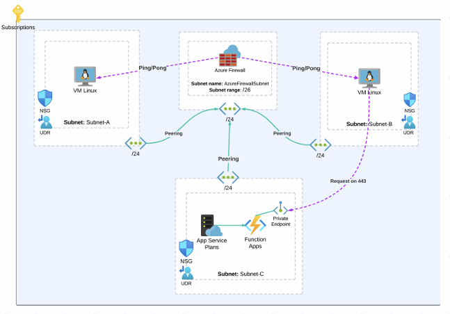

# Infraestrutura Azure com Terraform

Este projeto provisiona uma infraestrutura completa no Azure utilizando Terraform, com foco em segurança de rede, segmentação e integração de serviços internos.

## Requisitos do Projeto

- **Comunicação restrita entre VMs:**  
  As máquinas virtuais (VMs Linux) devem se comunicar entre si exclusivamente por meio do protocolo ICMP.

- **Tráfego inspecionado pelo firewall:**  
  Todo o tráfego deve ser direcionado ao Azure Firewall para tratamento, garantindo que apenas o ICMP seja liberado, tanto no firewall quanto nas NSGs (Network Security Groups).

- **Tabelas de rotas específicas:**  
  Cada sub-rede deve possuir uma tabela de rotas específica para redirecionar o tráfego ao firewall.

- **Function App com Private Endpoint:**  
  Uma Function App deve ser implantada com Private Endpoint para assegurar que o tráfego permaneça interno.

- **Acesso HTTPS ao Private Endpoint:**  
  Uma das máquinas precisa ter acesso ao Function App Private Endpoint no protocolo HTTPS.

## Estrutura do Projeto

```
.
├── .gitignore
├── diagrama.png
├── refs.txt
├── req.txt
└── terraform
    ├── core
    │   ├── .terraform.lock.hcl
    │   ├── common.tf
    │   ├── compute.tf
    │   ├── network.tf
    │   ├── providers.tf
    │   ├── storage.tf
    │   ├── variables.tf
    │   └── web.tf
    └── modules
        ├── common
        │   └── resource_group
        │       ├── main.tf
        │       ├── output.tf
        │       └── variables.tf
        ├── compute
        │   └── linux_virtual_machine
        │       ├── main.tf
        │       ├── output.tf
        │       └── variables.tf
        ├── network
        │   ├── association
        │   │   ├── subnet_network_security_group_association
        │   │   │   ├── main.tf
        │   │   │   └── variables.tf
        │   │   └── subnet_route_table_association
        │   │       ├── main.tf
        │   │       └── variables.tf
        │   ├── firewall
        │   │   ├── main.tf
        │   │   ├── output.tf
        │   │   └── variables.tf
        │   ├── firewall_policy
        │   │   ├── main.tf
        │   │   ├── output.tf
        │   │   └── variables.tf
        │   ├── firewall_policy_rule_collection_group
        │   │   ├── main.tf
        │   │   ├── output.tf
        │   │   └── variables.tf
        │   ├── network_interface
        │   │   ├── main.tf
        │   │   ├── output.tf
        │   │   └── variables.tf
        │   ├── network_security_group
        │   │   ├── main.tf
        │   │   ├── output.tf
        │   │   └── variables.tf
        │   ├── private_endpoint
        │   │   ├── main.tf
        │   │   ├── output.tf
        │   │   └── variables.tf
        │   ├── public_ip
        │   │   ├── main.tf
        │   │   ├── output.tf
        │   │   └── variables.tf
        │   ├── route_table
        │   │   ├── main.tf
        │   │   ├── output.tf
        │   │   └── variables.tf
        │   ├── subnet
        │   │   ├── main.tf
        │   │   ├── output.tf
        │   │   └── variables.tf
        │   └── virtual_network
        │       ├── main.tf
        │       ├── output.tf
        │       └── variables.tf
        ├── storage
        │   └── storage_account
        │       ├── main.tf
        │       ├── output.tf
        │       └── variables.tf
        └── web
            ├── function_app
            │   ├── main.tf
            │   ├── output.tf
            │   └── variables.tf
            └── service_plan
                ├── main.tf
                ├── output.tf
                └── variables.tf
```

## Diagrama da Solução



## Alguma das Referências Utilizadas

- [Azure Resource Abbreviations](https://learn.microsoft.com/en-us/azure/cloud-adoption-framework/ready/azure-best-practices/resource-abbreviations)
- [Terraform AzureRM Provider Docs](https://registry.terraform.io/providers/hashicorp/azurerm/latest/docs)
- [Terraform AzAPI Provider Docs](https://registry.terraform.io/providers/Azure/azapi/latest/docs)
- [Comparing firewalls: Differences between an inbound/outbound firewall](https://www.techtarget.com/searchsecurity/answer/Comparing-firewalls-Differences-between-an-inbound-outbound-firewall)
- [Azure Networking Overview](https://learn.microsoft.com/en-us/azure/networking/fundamentals/networking-overview)
- [Azure Virtual Network Subnets (Terraform)](https://learn.microsoft.com/en-us/azure/templates/Microsoft.Network/virtualNetworks/subnets?pivots=deployment-language-terraform)
- [Azure Route Table Management](https://learn.microsoft.com/en-us/azure/virtual-network/manage-route-table#prerequisites)
- [Azure Private Endpoint Overview](https://learn.microsoft.com/pt-br/azure/private-link/private-endpoint-overview#private-link-resource)
- [Azure App Service VNet Integration](https://learn.microsoft.com/en-us/azure/app-service/overview-vnet-integration#permissions)
- [Azure VM Sizes](https://learn.microsoft.com/en-us/azure/virtual-machines/sizes/overview?tabs=breakdownseries%2Cgeneralsizelist%2Ccomputesizelist%2Cmem-e-fam%2Cstoragesizelist%2Cgpusizelist%2Cfpgasizelist%2Chpcsizelist#list-of-vm-size-families-by-type)
- [Azure VM Resource (Terraform)](https://learn.microsoft.com/en-us/azure/templates/microsoft.compute/virtualmachines?pivots=deployment-language-bicep#usage-examples)

## Como usar

1. Configure suas credenciais em arquivo `.tfvars`.
2. Execute `terraform init` para inicializar o projeto.
3. Execute `terraform plan` para visualizar as mudanças.
4. Execute `terraform apply` para provisionar a infraestrutura.
---